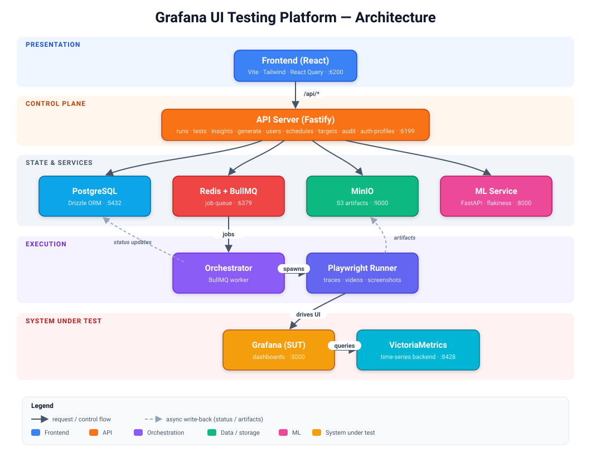

# Architecture

## Overview

The Grafana UI Testing Platform is a full-stack system for automated UI functional testing of Grafana deployments backed by VictoriaMetrics. It combines deterministic infrastructure, test generation, execution orchestration, ML-powered insights, and a modern web dashboard.



<details>
<summary>Text (ASCII) version of the diagram</summary>

```
┌──────────────────────────────────────────────────────────┐
│                     Frontend (React)                     │
│              Vite · TailwindCSS · React Query             │
│                     Port 6200                            │
└────────────────────────┬─────────────────────────────────┘
                         │  /api/*
┌────────────────────────▼─────────────────────────────────┐
│                  API Server (Fastify)                     │
│  Routes: runs, tests, insights, generate, users,         │
│          schedules, targets, audit, auth-profiles,        │
│          config, health                                   │
│                     Port 6199                            │
└──┬──────────┬──────────┬──────────┬───────────────────────┘
   │          │          │          │
   ▼          ▼          ▼          ▼
┌──────┐ ┌────────┐ ┌────────┐ ┌────────────┐
│ DB   │ │ Queue  │ │ Object │ │ ML Service │
│Postgres│ │ Redis/ │ │ Store  │ │  FastAPI   │
│      │ │BullMQ  │ │ MinIO  │ │ Port 8000  │
└──────┘ └───┬────┘ └────────┘ └────────────┘
             │
     ┌───────▼────────┐
     │  Orchestrator   │
     │  (BullMQ Worker)│
     └───────┬────────┘
             │  runs Playwright
     ┌───────▼────────┐      ┌───────────────────┐
     │   Playwright    │─────▶│  Grafana (SUT)    │
     │   Test Runner   │      │  Port 3000        │
     └────────────────┘      └───────┬───────────┘
                                     │
                              ┌──────▼──────┐
                              │VictoriaMetrics│
                              │  Port 8428   │
                              └─────────────┘
```

</details>

## Services

### 1. Frontend (`frontend/`)

| Attribute   | Value                              |
|-------------|-------------------------------------|
| Framework   | React 18 + Vite 6                  |
| Styling     | TailwindCSS 3.4 (class dark mode)  |
| Data layer  | TanStack React Query               |
| Routing     | React Router v6                    |
| Port        | 6200 (dev), proxies `/api` → 6199  |

**Key views:**

| View              | Route              | Purpose                                     |
|-------------------|--------------------|----------------------------------------------|
| RunsDashboard     | `/`                | Overview of all test runs                    |
| RunDetail         | `/runs/:id`        | Individual run results and artifacts         |
| TriggerRun        | `/trigger`         | Manually trigger a test run                  |
| TestCatalog       | `/tests`           | Browse all known tests with status           |
| TestHistory       | `/tests/:testId`   | Historical results for a single test         |
| Generate          | `/generate`        | Generate Playwright specs from dashboards    |
| Results           | `/results`         | Detailed test results list                   |
| FailureDrillDown  | `/results/:resultId` | Deep-dive into a specific failure          |
| Insights          | `/insights`        | ML-powered flakiness & clustering analysis   |
| Knowledge         | `/knowledge`       | Terminology & criteria reference (glossary)  |
| Schedules         | `/schedules`       | CRON-based run scheduling                    |
| Settings          | `/settings`        | Application configuration (tabbed shell)     |
| Auth Profiles     | `/settings/auth-profiles` | Reusable named credentials (admin-only tab) |
| Audit Log         | `/settings/audit`  | Who-did-what activity log (admin-only tab)   |
| Users             | `/users`           | User management (admin only)                 |
| Login / Register / Forgot Password | `/login`, `/register`, `/forgot-password` | Unauthenticated auth pages |

**Authentication & access control:**
- `useCurrentUser` hook backed by `localStorage` + `useSyncExternalStore`
- Role-based visibility: admin-only nav items (Users) hidden for regular users
- Unauthenticated users redirected to `/login`

### 2. API Server (`services/api/`)

| Attribute   | Value                           |
|-------------|---------------------------------|
| Framework   | Fastify 5                       |
| ORM         | Drizzle ORM                     |
| Database    | PostgreSQL 16                   |
| Port        | 6199                            |

**Route groups:**

| Prefix              | File                  | Description                          |
|---------------------|-----------------------|--------------------------------------|
| `/api/runs`         | `routes/runs.ts`      | CRUD for test runs                   |
| `/api/tests`        | `routes/tests.ts`     | Test catalog & history               |
| `/api/insights`     | `routes/insights.ts`  | Quarantine list, failure clusters    |
| `/api/generate`     | `routes/generate.ts`  | Trigger test generation              |
| `/api/users`        | `routes/users.ts`     | Auth, registration, user management  |
| `/api/schedules`    | `routes/schedules.ts` | CRON schedule management             |
| `/api/targets`      | `routes/targets.ts`   | Reusable run target environments     |
| `/api/audit`        | `routes/audit.ts`     | Audit log (who-did-what) access      |
| `/api/auth-profiles`| `routes/auth-profiles.ts` | Reusable named credentials / SSO sessions |
| `/api/config`       | `server.ts`           | App config get/set                   |
| `/api/health`       | `server.ts`           | Health check endpoint                |

Access control (`routes/rbac.ts`) and audit recording are applied as
middleware; test discovery helpers live in `routes/test-discovery.ts` (used by
the `tests` routes rather than registered separately).

### 3. Test Generation (`services/generation/`)

Converts Grafana dashboard JSON into Playwright test specs.

**Pipeline:**

```
Dashboard JSON/UID
       │
       ▼
   parser.ts       → Parse panels, variables, time ranges
       │
       ▼
   templates.ts    → Emit Playwright spec files (deterministic)
       │
       ▼
   llm-generator.ts → (optional) LLM-augmented edge-case generation
       │
       ▼
   tests/generated/ → Written spec files
```

**Test types:** Smoke, Sanity, Regression, E2E — each type controls the depth and breadth of generated assertions.

### 4. Orchestrator (`services/orchestrator/`)

BullMQ-based worker that:
1. Picks up run jobs from the Redis queue
2. Spins up the test environment (Grafana + VictoriaMetrics)
3. Executes Playwright tests with the specified selector
4. Collects results, artifacts (traces, screenshots, videos)
5. Uploads artifacts to MinIO (S3-compatible)
6. Updates run status in PostgreSQL

### 5. ML Service (`services/ml/`)

Python FastAPI service providing:
- **Flakiness detection** — scores tests by historical mixed pass/fail and retried-then-passed (`flaky`) results per commit; auto-quarantines at ≥15%
- **Failure clustering** — groups failures by normalized signatures
- **Triage suggestions** — recommends quarantine or investigation

## Database Schema

```
┌─────────────┐     ┌───────────────┐     ┌────────────┐
│    runs      │◄────│ test_results  │────▶│  artifacts │
│             │     │               │     │            │
│ id          │     │ id            │     │ id         │
│ status      │     │ run_id (FK)   │     │ result_id  │
│ selector    │     │ test_id       │     │ kind       │
│ grafana_ver │     │ status        │     │ object_uri │
│ trigger_src │     │ duration_ms   │     └────────────┘
│ commit_sha  │     │ failure_sig   │
│ started_at  │     │ cluster_id    │
│ finished_at │     └───────────────┘
└─────────────┘
                    ┌───────────────┐     ┌──────────────────┐
                    │  test_health  │     │ failure_clusters │
                    │  (ML-managed) │     │                  │
                    │ test_id (PK)  │     │ id               │
                    │ flakiness     │     │ representative   │
                    │ quarantined   │     │ size             │
                    └───────────────┘     └──────────────────┘

┌─────────────┐     ┌───────────────┐     ┌────────────────────┐
│   users     │     │  schedules    │     │   auth_profiles    │
│             │     │               │     │  (secrets encrypted)│
│ id          │     │ id            │     │ id                 │
│ email       │     │ name          │     │ name               │
│ name        │     │ cron_expr     │     │ auth_type          │
│ role        │     │ selector      │     │ username / secret  │
│ active      │     │ enabled       │     │ storage_state      │
│ password    │     │ created_by    │     └────────────────────┘
└─────────────┘     └───────────────┘

┌───────────────┐   ┌────────────────────┐   ┌───────────────┐
│   audit_log    │   │ test_type_overrides │   │   run_logs    │
│               │   │                    │   │               │
│ id            │   │ test_id (PK)       │   │ seq (PK)      │
│ actor_id      │   │ test_type          │   │ run_id        │
│ action        │   │ updated_at         │   │ stream        │
│ target_type   │   └────────────────────┘   │ message       │
│ target_id     │                            └───────────────┘
│ detail        │
└───────────────┘
```

Tables are defined via Drizzle ORM in `db/schema.ts` and migrated with
`npm run db:migrate`. The `app_config` key/value table is provisioned
separately by the API server (`services/api/server.ts`).

## Infrastructure (Docker Compose)

All infrastructure runs via `env/docker-compose.yml`:

| Service           | Image                               | Port  | Purpose                        |
|-------------------|-------------------------------------|-------|--------------------------------|
| Grafana (SUT)     | `grafana/grafana:11.4.0`            | 3000  | System under test              |
| VictoriaMetrics   | `victoriametrics/victoria-metrics`   | 8428  | Time-series data backend       |
| PostgreSQL        | `postgres:16-alpine`                | 5432  | Application database           |
| Redis             | `redis:7-alpine`                    | 6379  | Job queue (BullMQ)             |
| MinIO             | `minio/minio:latest`                | 9000  | S3-compatible artifact storage |

## CI/CD

| Workflow                              | Trigger   | Scope                         |
|---------------------------------------|-----------|-------------------------------|
| `.github/workflows/pr-smoke.yml`      | PR open   | `@smoke` tagged tests only    |
| `.github/workflows/nightly.yml`       | Cron      | Full suite, Grafana version matrix |

## Technology Stack Summary

| Layer        | Technology                                                |
|--------------|-----------------------------------------------------------|
| Frontend     | React, Vite, TailwindCSS, TanStack Query, React Router    |
| API          | Fastify, Drizzle ORM, Zod                                 |
| Testing      | Playwright, Vitest                                        |
| Generation   | Custom parser + template emitter, Anthropic Claude (opt.)  |
| Queue        | BullMQ on Redis                                           |
| Database     | PostgreSQL 16                                             |
| Storage      | MinIO (S3-compatible)                                     |
| ML           | Python, FastAPI, scikit-learn                              |
| Infra        | Docker Compose                                            |
| CI           | GitHub Actions                                            |

## Roadmap / Enhancements

Proposed improvements are tracked in [enhancements.md](./enhancements.md).
